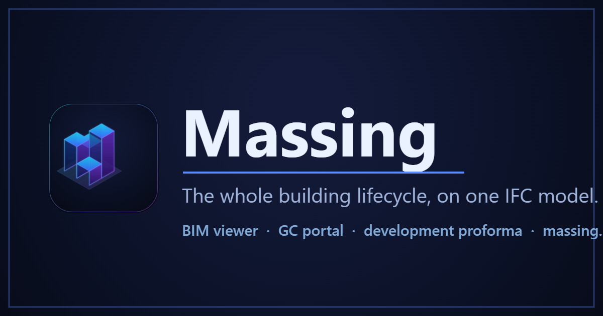
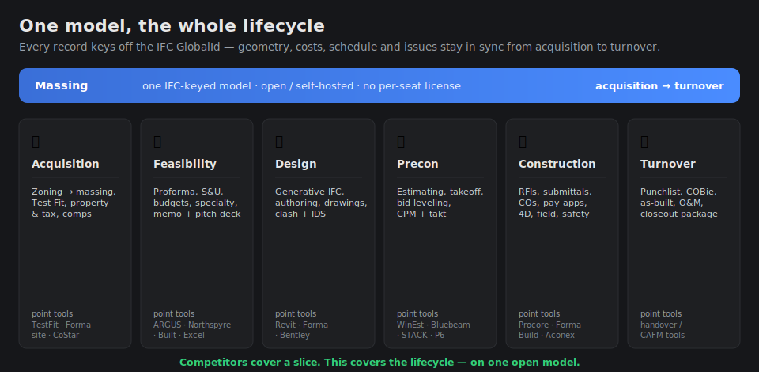
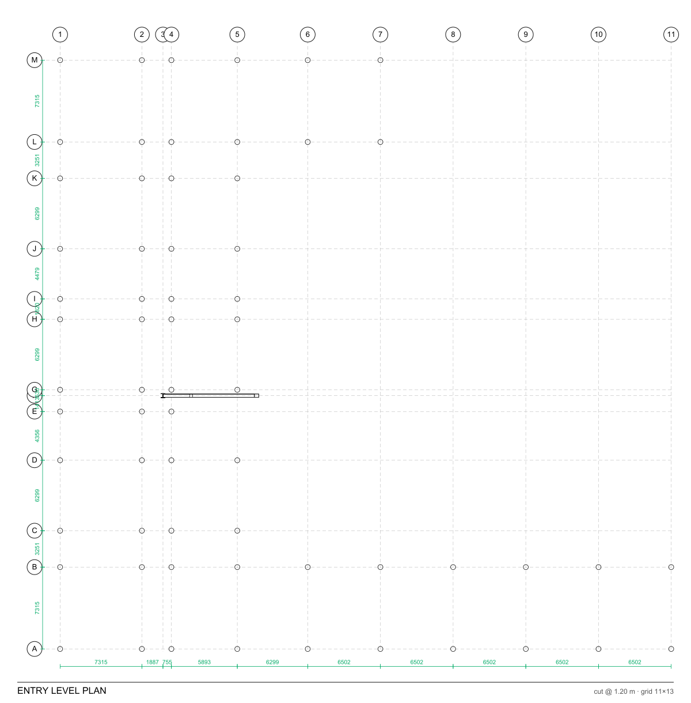
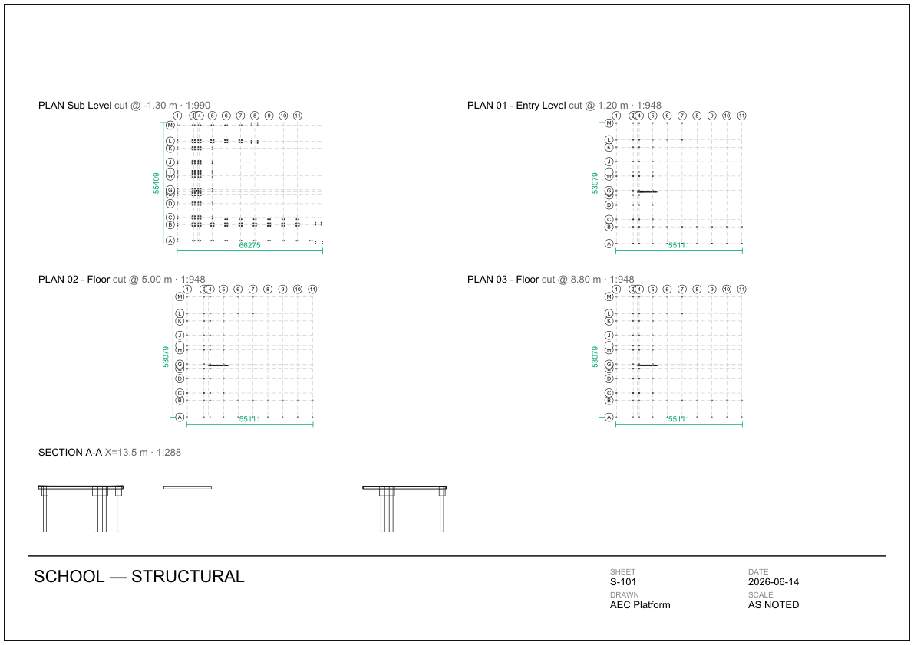
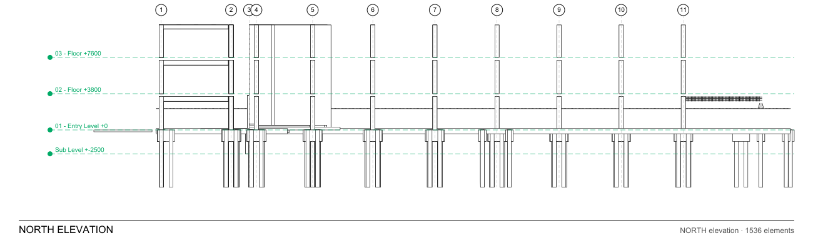

# Massing — in-browser BIM authoring · construction docs · GC portal · proforma



[](https://github.com/ibuilder/massing/actions/workflows/ci.yml)
[](https://github.com/ibuilder/massing/releases/latest)
[](https://github.com/ibuilder/massing/releases)


[](LICENSE)
[](https://massing.build/app/)

> **Open, self-hosted, IFC-native AEC platform.** A genuine **in-browser BIM authoring tool** — model
> from scratch (blank or a template) and draw/drag-edit real IFC by GUID across architecture · structure ·
> MEP, **generate a permit-ready construction-document set** (plans, sections, elevations, schedules →
> SVG/PDF/DXF, issuable ARCH-D sheets, a 3-part MasterFormat spec manual), **pre-check code** (IBC
> occupancy/egress, jurisdiction-adopted editions, an approvability pre-flight), and **hand over
> field-verified as-built data** (LOD-500 + manufacturer/serial, COBie-ready). Plus a **near-100-module GC
> portal** (RFIs, pay apps, CPM schedule, TRIR) and a **development proforma** — **one model, from land
> acquisition through operations.** Generate a building from a zoning envelope, or model it by hand; then
> coordinate, schedule, underwrite & operate it. Built on **That Open + IfcOpenShell**. **$0 to run.**

**What it is** — three pillars on one IFC-keyed model, switched by a Model / Construction / Finance bar:

- 🧊 **BIM platform** — a genuine **in-browser authoring tool** on That Open Fragments, from a blank model
  to a permit-ready set: draw/edit walls (incl. **sloped-top parapet/shed/gable**), columns, slabs,
  doors/windows, **curtain walls, steel connections, rebar cages and MEP** (with **port-to-port
  connectivity**) by **GUID-stable server-side recipe**, with **drag-to-move edit-in-place**, **model
  undo/redo**, automatic **drawing inference** (auto on-axis/parallel/perpendicular snap), a
  family/type system, groups/arrays, **phasing**, **LOD dialing (100→500)**, a **site content library**
  (logistics/furniture/landscaping, auto-classified), a **procedural-mesh** and an AST-**sandboxed
  ifcopenshell** escape hatch (feature-flagged), **authoring guardrails** that reject broken IFC, and an
  a **CAD command line** (AutoCAD-style `WALL 0,0 5,0 3` / `COLUMN 2,2` with aliases, history and
  spacebar-repeat) alongside an **AI command bar** (type what to build in plain English); **generate the construction-document
  set** — plans/sections/elevations/schedules → **SVG · PDF · DXF**, issuable ARCH-D sheets with titleblocks,
  and a **3-part MasterFormat project manual**; **code intelligence** — IBC code-analysis (G-series) summary,
  **edition-aware** occupancy-load + egress pre-check, jurisdiction-adopted code editions, an
  **approvability pre-flight**, a **detail-rule engine**, and a **decision-readiness (RFI-prevention) audit**;
  plus a **productivity-rate labour estimate**, QA, IDS, BCF, **PDF takeoff** (calibrated measure / area /
  count); **layer &
  align multiple models** with **federated cross-discipline clash**; **raise 2D → BIM** (DXF floor plan → IFC
  walls + spaces) and check the built result with **scan-to-BIM deviation** (as-built point cloud vs the model
  surface, % within tolerance + heatmap); also opens **meshes & point clouds** (OBJ/STL/PLY/glTF ·
  PCD/XYZ/**LAS/LAZ**) and **GIS / topography** (**GeoJSON** vectors · **GeoTIFF** DEM terrain) as
  georeferenced reference overlays, with **QR sharing**
- 🏗 **GC portal** — config-driven modules: RFIs, submittals, change orders, pay apps (G702/G703), CPM schedule, safety/TRIR, closeout (COBie); **specification register → spec-driven submittal log** (AI/rules extraction of typed submittals from the spec book, with missing-submittal coverage); **contract & change-order documents** (AIA-style generate · Exhibit A scope · redline · per-party + **PAdES digital** e-sign); **Report Center** (executive / cost / EVM / logs → PDF + Excel)
- 💵 **Development proforma** — sources & uses, S-curve draws, XIRR/NPV, JV waterfall — seeded straight from the model


**[▶ Live demo](https://massing.build/app/)** · **[⬇ Download (Win/macOS/Linux)](https://github.com/ibuilder/massing/releases/latest)** · **[📚 Guides](https://massing.build/guide.html)** · **[📄 Project page](https://massing.build/)**

### Quickstart — self-host the full stack

```bash
docker compose --profile full up --build      # web → http://localhost:8080 · api → http://localhost:8000
docker compose --profile full --profile seed run --rm seed   # optional: a demo project across every module
```

Or install the signed desktop app (single-project, auto-updating) from the [latest release](https://github.com/ibuilder/massing/releases/latest).

**Built on** [That Open](https://github.com/ThatOpen) (Fragments + web-ifc, MIT) · [IfcOpenShell](https://ifcopenshell.org) (LGPL) · [three.js](https://threejs.org) · [FastAPI](https://fastapi.tiangolo.com) · [Tauri](https://tauri.app). IFC is the source of truth — no proprietary format, no per-seat license.

## The whole lifecycle, on one model

Most AEC software covers a single slice — feasibility, or BIM, or construction management. This
platform spans the **whole lifecycle on one IFC-keyed model**: acquisition → due diligence &
entitlements → feasibility → design → preconstruction → construction → turnover → **operations**
(CMMS, metered energy, reserves/CIP, CAM, ESG/POE), with every artifact (proforma, model, RFI,
pay app, COBie, work order, meter reading) tied to the same GlobalIds.



- **Pre-acquisition** — due-diligence studies (Phase I ESA, geotech, title…) + entitlement
  pipeline with a go/no-go readiness rollup.
- **Feasibility + underwriting** — proforma, sources & uses, investment memo.
- **Concept programming** — spaces as an adjacency graph (area × quantity → gross area + use mix
  that feeds the massing generator).
- **Generative massing + test fit** — zoning envelope → buildable program → real IFC building.
- **openBIM standards (ISO 19650)** — a Common Data Environment (WIP → Shared → Published →
  Archived), information-requirements register (EIR/BEP/AIR), model-quality scoring (IDS compliance,
  LOIN, export health, bSDD), a 10-category BIM-KPI scorecard, and standards-compliance checks.
- **BIM authoring + coordination** — from-scratch in-browser modeling (blank/template start, Draft
  toolkit, drag-to-move edit-in-place, manage levels, model browser with group-by/search, selection
  sets), clash detection, IDS validation.
- **openBIM data depth (Wave 9)** — **property mapping / normalization** (remap vendor psets onto an
  IDS/employer structure, the transform between validation and export); **IFC5-style property-override
  layers** (non-destructive composition with conflict detection + bake); a **semantic model graph**
  (multi-hop, cited IFC-relationship queries); **computed code pre-check** (occupancy load + egress
  capacity, IBC-cited); **generative fit-out** (auto-furnish spaces); and **site logistics on the 4D
  timeline** (schedule-windowed cranes/laydown/gates).
- **AI over the model** — an MCP server so external agents (Claude Desktop) can drive the project,
  drawing-sheet extraction, and grounded standards experts. Offline-first; nothing fabricated.
- **Construction management** — RFIs, submittals, change orders, pay apps, 4D/5D.
- **Turnover** — COBie, as-built, closeout, certified substantial completion (G704).
- **Operations** — CMMS work orders + preventive maintenance, utility meters → EUI, reserve
  study + capital plan, **facility condition assessment** (UNIFORMAT II elements → **Facility
  Condition Index** + portfolio prioritization, feeding the reserve forecast), CAM reconciliation,
  ESG rollup (GHG Scope 1/2) + post-occupancy evaluation.
- **Climate & water resilience** — flood risk (ASCE 24 / FEMA **Design Flood Elevation** + a
  flood-proof-MEP check flagging equipment installed below it), stormwater sizing (**Rational
  Method** Q = C·i·A peak runoff + detention volume), **weather-sequenced construction**
  (weather-sensitive activities + a site-weather-hazard register + weather-delay days from the daily
  reports), and a **physical climate-risk rating** that rolls up into the ESG scorecard — rainfall and
  flooding as quantifiable parameters across the lifecycle.
- **IFC-native, open, self-hostable** — no per-seat license; the desktop app is free.

## What it does

Highlights, all **built and verified** in this repo unless noted:

- **Web viewer** — Three.js + Fragments, streams large models, runs fully offline (local WASM).
- **Navigation & review** — select→properties, spatial tree, layers, isolate/hide, ghost,
  section planes, measure, color-by-data, set-origin/CRS.
- **Coordination** — model federation; **clash detection** (AABB broad phase + mesh
  boolean narrow phase, exact penetration volume) → BCF clash topics.
- **Issues** — BCF-modeled topics/RFIs/punch/clash, viewpoints, comments, attachments,
  pins; `.bcfzip` import/export (round-trips with any BCF-compatible openBIM tool).
- **QA** — **IDS validation** (ifctester) with failing-element highlighting.
- **4D / 5D** — schedule↔element mapping; quantity takeoff + cost mapping (geometry fallback).
- **Data export** — QTO, COBie, space schedules → XLSX.
- **2D documentation** — dimensioned grid **plans** (grid derived from columns), **sections**,
  **elevations** (N/S/E/W) with level lines, and composed **PDF sheets** with title blocks.
- **Authoring round-trip (in-browser modeling)** — a full toolkit of authoring ops, each a
  server-side `ifcopenshell` recipe → background republish (reconvert + reindex). GUID-stable,
  so pins/RFIs/clashes survive. **Start:** a blank model (levels + ground datum) or a starter
  template (office bay / residential floor / warehouse). **Create:** walls (incl. **sloped-top** —
  parapet-slope / shed / gable), slabs, columns, beams, roofs, rooms/spaces (sketch on the model/grid);
  **parametric doors/windows** (real lining/frame/panel) that void the host wall + fill it. Free-hand
  drawing lands clean lines automatically via **automatic axis inference** (auto on-axis / parallel /
  perpendicular snap within ~6°, no Shift needed). **Fabrication / LOD 350-400 (behind an "Advanced"
  toggle):** **curtain-wall systems** (mullions/transoms + glazing), **structural steel connections** (base
  plates, shear tabs + bolts as `IfcElementAssembly`), **rebar cages** (longitudinal bars + stirrups), **MEP
  fittings** (elbows/tees/transitions with ports + distribution systems) with **port-to-port connectivity**
  (`IfcRelConnectsPorts` + a dangling-element report), a **procedural mesh** (author an element from a raw
  triangle mesh → `IfcTriangulatedFaceSet`), and an AST-**sandboxed `ifcopenshell` escape hatch** (off by
  default, feature-flagged) for geometry the recipes can't express. **Site content:** a **content library**
  places logistics (cranes / hoists / fencing / sanitary units / laydown), furniture and landscaping, each
  auto-classified into the right IFC class + phase (logistics time-phase on the 4D slider) + Uniclass/OmniClass.
  **Edit:** **drag-to-move edit-in-place** (transform gizmo + ghost preview) with full **model undo/redo**
  (every edit is versioned, GUID-stable), plus typed delete / move / rotate / copy / per-element
  Pset edit, **groups & arrays**, and **phasing** (new / existing / demolish / temporary). **Organize:**
  a **power-selection query** (the IfcOpenShell selector DSL — by class, material, pset value) saved as
  reusable selection sets; **LOD dialing** (tag elements 100→500 on a view-keyed representation spine).
  **Levels:** rename + set-elevation. **Browse:** model tree grouped by level / discipline / class / type
  with search. **Drafting aids:** grid + corner snap, a 6-face section box, a storey-levels overlay.
  **Reliability:** **authoring guardrails** (`guards.py::precheck`) reject broken edits (zero-length walls,
  non-finite coordinates, bad dimensions) *before* they touch the model. **AI command bar:** type an
  instruction ("a 5×4 m room at 0,0", "steel column W14×30 at 6,6") — a deterministic keyword baseline
  works with zero setup, and an optional Claude multi-step planner turns one instruction into a validated,
  confirm-before-apply plan (it never invents GUIDs; every step re-validates through the same guardrail).
  Verified live end-to-end (new model → draw → edit-in-place → clash → export). Desktop GUI authoring is
  the optional Blender + Bonsai bridge.
- **Construction-document set (author → issuable sheet)** — generate a permit set straight from the
  authored geometry (deterministic, from extruded-profile footprints — no geometry kernel): **plans**
  (class-styled poché, dimensions, keynote bubbles + legend from the model's spec codes, and **NCS-style
  detail callouts** — a divided circle + leader on every element carrying an attached detail, with a keyed
  DETAILS legend), auto-centred
  **sections** (X-X / Y-Y) and projected **elevations** (N/S/E/W), and computed **door / window / room
  schedules** — each as **SVG**, laid out on an **issuable ARCH-D (36×24″) sheet** with a border +
  titleblock, and exported to **PDF** (via reportlab) and **DXF** (a dependency-free R12 writer for CAD
  interchange). Plus a **3-part MasterFormat project manual** — the model's elements grouped into CSI
  divisions → sections in SectionFormat shape (Part 1 General / Part 2 Products / Part 3 Execution) from
  their work-result classifications + attached detail documents. A **detail-rule engine** (IDS-shaped
  condition → content) auto-attaches keynotes, spec codes and installation details — e.g. a window in an
  exterior wall gets the IBC/ASTM/AAMA flashing detail + MasterFormat/UniFormat codes — and validates as
  author-time QA.
- **Code intelligence (pre-check, cites sections)** — a permit set's **G-series IBC code-analysis
  summary** computed from the model (occupancy classification, construction type, area + story count, the
  computed occupant load + egress, governing allowable-area/height + fire-rating sections); an
  **occupancy-load + egress pre-check** (per-space load, required vs provided egress width, 32-in door +
  two-exits-over-49 checks) whose **occupant-load factors are edition-aware** — a jurisdiction on an older
  IBC cycle (e.g. Business at 100 gross ft²/occ in 2012/2015 vs 150 in 2018+) computes a higher load and
  egress width than the current baseline; a **jurisdiction-adopted-edition catalog** (`codes.py` — the
  I-Code families + their 3-year editions, resolved per US state) so citations name the edition in force
  ("IBC 2021 Table 506.2 …"); an **approvability pre-flight** — a plan-reviewer readiness checklist (egress
  capacity, door clear width, two-exits, occupancy classification on spaces, substantiated rated assemblies)
  scored for permit-readiness; and a **decision-readiness (RFI-prevention) audit** — the proactive inverse
  of the RFI, composing failed code checks, elements missing a required detail/keynote, model-hygiene gaps
  (orphaned / unenclosed / unnamed / duplicate) and open clashes into one **ranked resolve-before-issue
  list** (category + severity + fix), isolating each flagged element in 3D. A pre-check assist that cites
  sections — not a certified review; verify with the AHJ.
- **LOD-500 / turnover (field-verified as-built)** — stamp elements **field-verified as-built**
  (`Massing_AsBuilt`: Status + VerifiedBy/Date/Method/Note provenance) with a **readiness** rollup by
  method (field-measure / laser-scan / total-station / photo / submittal / inspection); stamp
  **field-verified as-built dimensions** (`Massing_AsBuiltDim`: measured value, design value, the
  **variance**, and a within-tolerance flag — measured-vs-design capture, with an out-of-tolerance count);
  stamp **manufacturer/serial** data (`Pset_ManufacturerTypeInformation` + `Pset_ManufacturerOccurrence`)
  that round-trips to COBie and CMMS/asset systems; and a composite **Model Health scorecard** across five
  lenses — integrity, ISO-19650 information, clash coordination, verified-as-built, and **Code &
  permit-readiness** (from the approvability pre-flight).
- **Generative design — zoning → a fully-developed IFC building + proforma** — enter a municipal
  zoning envelope (lot, FAR, coverage, setbacks, height
  limit, floor-to-floor) and the platform computes the buildable program (footprint, floors, GFA,
  units, **binding constraint**) and **generates a real IFC4 model** in one call — optionally with a
  **concrete structural frame** (columns + beams on a bay grid), **per-apartment unit layout**, a
  **facade envelope** (walls + ribbon windows at a WWR, feeding the energy model), and a **service
  core** (elevator + stair + MEP risers) — then publishes it and solves a **starter acquisition
  proforma**. Because the output is openBIM, the generated building flows straight into the viewer,
  drawings, energy, QTO, the **assembly-based estimate** (+ GFA benchmark) and underwriting — one
  chain from lot → deal → turnover. Driven end-to-end through a full lifecycle harness (63/63).
- **Furnish & equip (starter IFC family library)** — a curated 16-family catalog (furniture /
  sanitary / appliances / plants) generated parametrically, placeable into *any* model (incl. a
  generated massing) as real, **GUID-stable, typed** IFC occurrences via `type.assign_type`.
- **Sign-in (SSO) + free tier, no admin** — log in with **Google / Microsoft / Procore** (OAuth2);
  SSO users are plain **free-tier** accounts and there's **no admin tier for end users** (project
  owners manage their own teams; platform config is ops/env). A `tier` seam (`entitlements.py`)
  makes the eventual paid plans a one-place change.
- **First-run onboarding + AI assistant** — a skippable welcome + coach-mark tour for new users, and
  an **"Ask AI"** box that answers natural-language questions about a project (open RFIs, overdue,
  cost) grounded in a live snapshot (Claude when keyed; graceful no-key fallback).
- **Field/mobile capture (offline-first)** — a mobile bottom-sheet quick-capture: snap a photo →
  punchlist / safety observation / progress photo in a couple taps. Captures queue offline (photo
  included) and **auto-sync on reconnect** (queued-count badge); pairs with the PWA/Capacitor build.
- **Turnover** — a one-click **closeout package** (`/closeout/package.zip`: as-built IFC +
  COBie/QTO/spaces + status PDF + closeout manifest), **module-log PDFs** (RFI/submittal/CO
  registers), **multi-period pay apps** (period advance + auto **lien waivers**), **COBie tabs**
  enriched with warranties/assets/commissioning, and **warranty-expiry** tracking.

## General Contracting Portal

A construction-management portal on top of the viewer — full writeup in
[docs/gc-portal.md](docs/gc-portal.md). Highlights:

- **Module engine** — every process (RFIs, Submittals, PCO/Change-Order chain, Daily
  Reports, …) is a `module.json` → its own auto-created table. **80 modules / 16 sections**,
  no per-module code. Each gets CRUD, role-gated workflow, comments, CSV/PDF, pins, timeline.
- **Two role dimensions** — capability roles (viewer→admin) + party roles
  (GC/Owner/OwnersRep/Consultant/Subcontractor) that gate workflow transitions.
- **Change-order chain** — PCO ▸ NOC ▸ Directive ▸ Proposal ▸ COR ▸ eTicket, linked and
  audit-logged; approved CORs flow into the contract sum.
- **Financials** — AIA **G702/G703** pay apps (+ PDF), **Cost Summary** roll-up, **eTicket
  T&M builder** priced from rate tables, and a **WIP schedule** (percentage-of-completion) whose
  physical progress can be **cross-checked against the model** — installed elements ÷ total by IFC
  GlobalId, flagging cost running ahead of what's actually built.
- **Schedule** — Gantt + Empire-State **Line-of-Balance** charts.
- **Role-tailored dashboard** — per-party KPIs + "ball-in-your-court" action items.
- **Model pins** — any anchored record (RFI/PCO/COR/punchlist/inspection/…) shows on the
  3D model; clicking selects the element and opens the record. Same GUID keys geometry,
  BCF, and GC records.

## Real-Estate Development & Feasibility (Finance workspace)

A developer/owner platform that goes **lot → building → deal → investor package**, all IFC-native.

**Generative design & Test Fit** (openBIM — every fit is a real IFC model):
- **Generate from zoning** — lot + zoning envelope (FAR, setbacks, height, coverage) → a buildable
  program + a from-scratch **IFC4** model (structural frame, per-unit spaces, facade + windows,
  service core) + a solved acquisition proforma, one click. Real **lot polygons** (shoelace area).
- **Test Fit** — fit a unit mix on a **double-loaded corridor** (real units + corridor), a **parking
  solver** (stalls/unit → count/area/cost), **scheme compare** (units/efficiency/NSF/parking ranked),
  and **generative optimize** that sweeps unit-mix × parking and ranks by **yield-on-cost** ("find the
  deal that pencils"). `POST /test-fit/{compare,optimize}`.

**Developer cost portal** — the institutional underwriting facets:
- **Line-item hard/soft cost budgets** (description × $/unit × qty + per-category contingency) that
  roll into the proforma cost tree.
- **Sources & Uses** — grouped uses vs sized senior debt (LTC capped by LTV/DSCR/debt-yield) + equity.
- **Property & tax assumptions** — parcel/areas/purchase + tax table → OPEX; per-SF ratios.
- **Specialty assets** — on-site **energy** (solar/wind/battery/rainwater → capex + energy offset) and
  **vertical-farm/PFAL** (tower count → produce revenue + lighting opex), flowing into the deal.
- **Investment memo (PDF)** — a confidential memorandum (exec summary, S&U, cost budget, returns,
  risk) generated from live project data: the "presentation with financials."

**Underwriting engine:**
- **Sources & uses** with construction-loan **interest-reserve circularity** solved to a fixed point.
- **S-curve draws**, **XIRR / NPV / equity multiple / yield-on-cost**, a **JV waterfall** (pref +
  promote tiers, American/European, clawback), **debt sizing** (LTC/LTV/DSCR/debt-yield), **sensitivity**
  tables and **Monte Carlo** risk.
- **Underwriting realism** — specialty/operating revenue is **risk-adjusted** (not booked as de-risked
  rent), and **guardrails** flag returns outside market bands (IRR / equity-multiple / dev-spread /
  DSCR) so the IRR is credible, surfaced on a sticky returns bar.
- **Actuals/draws bridge** → re-forecast IRR + AIA G702/G703 pay apps off the *same* cost tree.
- **Multi-deal portfolio** roll-up (true XIRR) and **LP-shared** read-only scenarios.

The Finance workspace is organized into sub-tabs — **Feasibility · Budget & Capital · Underwriting ·
Deliverables** — with a sticky live-solved returns bar.

## Recent platform work

> **The full log lives in [CHANGELOG.md](CHANGELOG.md)** (every release, newest first). The highlights below
> are a rolling snapshot; the [roadmap](docs/roadmap.md) tracks what's still open.

- **Analysis depth, model QA and dev-velocity (v0.3.372–v0.3.412, current).** The **complete structural
  analytical chain** — gravity + lateral solve (ASCE 7 seismic ELF + wind MWFRS with a **§12.12 story-drift
  screen** and torsional-irregularity flag), member loads, shear-wall/slab surfaces, base supports → a
  solver-ready IFC. **MEP-SIZE** velocity checks, plan **VIEW-RANGE**, the rendered **COVER-SHEET** +
  drawing index, **EXPORT** (.glb + first-class IFC re-export), and 2D **TAKEOFF** from PDF/scan sheets.
  Model QA grew teeth: **element-level version diff** (what actually changed — renamed / re-typed /
  re-leveled / property & quantity deltas, click-to-select in 3D), an **export round-trip fidelity check**
  (proves the write path drops nothing — schema, units, GUIDs, storeys, property payload), and money-math
  regression tests across leases and change orders. Under the hood, a **dev-velocity program**: the test
  gate parallelized ~30 min → ~11 min, backend + web **import-cycle guards** in CI, and the worst files
  decomposed behind façades (the 2,127-line authoring engine → a foundation + five recipe leaves at 761
  lines, connectors and sheet renderers split the same way) — zero public-API change, all suites green.
- **Frontier tracks + designer-workspace UX + hardening (v0.3.341–v0.3.371).** Five large tracks
  landed end to end. A **structural analytical model** — `derive_analytical` idealises the physical frame into an
  `IfcStructuralAnalysisModel` (columns/beams → curve members, slabs → surface members, shared nodes, a
  self-weight load case). An **RFI-0 NL-QA** layer answers plain-language questions ("what governs this element?",
  "what's blocking approval?") with **cited sources** off a new **document/specification graph**. **Real-time
  co-editing** — a model-edit SSE stream + presence roster live-reloads a second viewer after a collaborator
  publishes, with an **optimistic edit-lock** (stale write → 409). A **visual node-authoring canvas** wires
  recipe nodes into a graph (output→input auto-injects the reference) and runs it as one GUID-stable pass. The
  **designer workspace** finished — a lifecycle **ribbon** over the tool rail, `type:`/`class:`/`discipline:`
  Library search + Recent, and a **Project-Browser spine** (views · sheets · schedules). Plus a **security
  hardening pass** — XXE-safe schedule-import parsing, dependency pins, and a clean audit (npm 0 vulns · bandit
  HIGH → 0 · secret-scan clean). See the changelog for each release.

- **Unified discipline tree · interactive annotation · 5D cost + vintages (v0.3.309–v0.3.340).** One
  canonical **CSI-MasterFormat / UniFormat / NCS discipline** vocabulary with a **colour palette** across the
  viewer, model browser, estimate, and both engines — **colour-by-discipline** in the 3D view (legend + paint
  model) and a MasterFormat-coded rollup. **Fire protection, fire alarm, and telecom** became first-class
  systems (`add_fire_equipment` / `add_fa_device` / `add_comms_device`), and the demo tower was rebuilt with a
  unitized **curtain-wall facade**, **fire-rated** construction, a **roof assembly**, and all eight disciplines.
  **Interactive annotation** — place `IfcAnnotation` notes, dimensions, element-aware **tags**, and **revision
  clouds** in the view, rendered onto the plans. **Cost + schedule depth** — a **vintage-versioned cost
  database** (COST-DB) so a project pins the exact cost vintage its estimate was built on (reproducible;
  offline public importer + a subscription-cloud path), the estimate prices **through** the pinned vintage, and
  the labour estimate rolls crew-days into a **schedule duration**. **Code depth** — an **existing-building**
  (IEBC) work-area classifier, **missing-dimension** detection in the RFI-prevention audit, and the applicable
  code requirements emitted as a validatable **buildingSMART IDS**. See the changelog for each release.

- **Wave 11 — LOD-400/500 authoring + the construction-document set (v0.3.255–v0.3.308).** The
  Model workspace became a genuine authoring-to-issue tool. A **view-keyed representation + LOD spine**
  (tag elements 100→500); a **power-selection** query over the IfcOpenShell selector DSL; **parametric
  door/window** generators (real lining/frame/panel); a **domain-geometry catalog** behind an "Advanced
  fabrication" toggle — **steel connections** (base plates, shear tabs), **rebar cages**, **MEP fittings**,
  and **curtain-wall systems**; **classification + detail-document carriers** and an **IDS-shaped
  detail-rule engine** (exterior-window → IBC/ASTM flashing detail + spec/keynote codes). On top: the whole
  **construction-document set** — plan/section/elevation SVG → **PDF + DXF**, **issuable ARCH-D sheets**
  with titleblocks, computed **door/window/room schedules**, and a **3-part MasterFormat project manual**.
  **Code intelligence** — a **G-series IBC code-analysis** summary, a **jurisdiction-adopted-edition**
  catalog, and an **approvability pre-flight** (permit-readiness). **LOD-500 turnover** — field-verified
  **as-built** stamping + **manufacturer/serial** (COBie-ready), rolled into a five-lens **Model Health
  scorecard**. And the **AI authoring command bar** — natural language → a validated recipe plan
  (deterministic baseline + optional Claude multi-step planning), guarded by an **authoring guardrail**
  that rejects broken IFC before it writes. The **Master-Builder** close-out (v0.3.294–v0.3.308) then made
  the tool complete: **model undo/redo** (versioned, GUID-stable), automatic **drawing inference**,
  **sloped-top walls** (parapet/shed/gable), a **procedural-mesh** and an AST-**sandboxed `ifcopenshell`**
  escape hatch (feature-flagged; a proven RCE escape closed on review), a **site content library**
  (logistics / furniture / landscaping, auto-classified + logistics time-phased on the 4D slider), **MEP
  port-to-port connectivity** + a dangling-element report, **NCS detail callouts** on the plan,
  **edition-aware** occupant-load factors, a **decision-readiness (RFI-prevention) audit**, a
  **productivity-rate labour estimate** (man-hours/unit → cost + crew-days + duration), and **field-verified
  as-built dimensions + variance** for the LOD-500 turnover layer. See the changelog for each release.

- **Since v0.3.113 — the platform filled out end to end (→ v0.3.228).** The complete
  **acquisition → design → build → turnover → operate** lifecycle (RIBA/AIA phase gates, soft-cost
  itemization, ASI/bulletins/SK, G704 turnover, FCA/FCI + reserves operations); **openBIM standards depth**
  (IDS→BCF, bSDD, COBie Contact/Zone/System, IFC4.3 infra, ISO 19650 CDE); **AI over the model**, the
  per-discipline **drawing-set spine**, **climate/water resilience**, **scan-to-BIM + 2D→BIM + Gaussian
  splats**; enterprise **auth** (TOTP MFA, SAML/SCIM, session revocation); and a four-domain
  **code-quality/hardening** initiative. Most recently, **generative-design & analysis depth**: per-floor
  **column taper + lateral core**, **parcel-aware surface parking**, a specialty **multi-year P&L + ramp +
  blended IRR** with **Monte-Carlo** risk, **actual-vs-takt** production tracking, a per-project **material
  editor**, a **module-relations graph**, a 9-slide **investor pitch deck**, and a **Finance command-center
  home**. See the changelog for each release.

- **The earlier record (v0.1 → v0.3.113)** — module engine + workflow gating, proforma/waterfall,
  EVM, authoring from the first Draft panel through steel/rebar/MEP families, document control,
  market intelligence, openBIM CDE/KPI depth, lean pull-planning, operations/resilience, and the
  design-to-turnover lifecycle — lives release-by-release in [CHANGELOG.md](CHANGELOG.md) and
  thematically in [docs/roadmap-completed.md](docs/roadmap-completed.md).

## Gallery

**Generative design — lot → IFC model → acquisition proforma** (openBIM end to end): a zoning
envelope generates a real IFC massing you can then furnish from a starter
family library. (Vector renders of the redesigned UI; numbers are an actual solve.)

| Generate from zoning → IFC + proforma | Furnish & equip (starter IFC family library) |
|---|---|
|  |  |

Generated directly from the IFC by the data service (BIM), plus GC schedule charts:

| Dimensioned grid plan | Composed sheet (A3) | North elevation (HLR) | Room tags |
|---|---|---|---|
|  |  |  |  |

The dimensioned plan derives the structural grid from column positions (no `IfcGrid` needed),
adds numbered/lettered bubbles and grid-spacing dimensions; the sheet composes per-storey
plans + a section under a title block (also exported as PDF).

GC portal schedule visuals (from the `schedule_activity` module):

| Gantt | Line of Balance |
|---|---|
|  |  |

Platform interface (vector renders of the redesigned UI — see the [live demo](https://massing.build/app/) for the running app):

| Tools panel + readable results | 80-module portal catalog |
|---|---|
|  |  |

The ⚙ Tools panel is a persona-ordered, collapsible, state-aware accordion (secondary tools fold
under "More tools"; analysis opens in a readable modal); the GC-portal catalog tames 80 modules
with ★ favorites, collapsible persona-aware sections, and a filter.

## Architecture

```
            IFC  (source of truth)
   author ▲                       │ convert + tile
          │                       ▼
  Blender + Bonsai         services/converter (Node)   IFC → .frag tiles
  (Bonsai-MCP)                    │
  services/data (Python, ifcopenshell)                 props index · QTO/COBie/4D/5D ·
    clash · IDS · drawings/sheets · authoring recipes   exports · validation · 2D drawings
          │                       │
          └──────► services/api (FastAPI) ◄──────► apps/web (Vite + TS, Three.js + Fragments)
             BCF issues · pins · viewpoints · properties · exports · clash · validate ·
             drawings/sheets · edit/publish      (Postgres/SQLite + MinIO/local storage)
```

## Layout

```
apps/web/            Vite + TS viewer (Three.js + @thatopen/*), integrated app shell
apps/editor-bridge/  Bonsai-MCP config + authoring recipes (desktop path)
services/converter/  IFC→.frag (Node) + optional RVT→IFC via APS (paid, flagged)
services/api/        FastAPI: BCF, properties, exports, clash/validate, drawings, edit/publish,
                       GC portal (modules, cost, schedule, dashboard)
services/api/modules/  80 module.json definitions (GC portal — one table each)
services/data/       IfcOpenShell: index, QTO, COBie, spaces, schedule, clash, IDS, drawings, edit,
                       massing (zoning→IFC), families (starter IFC type library)
packages/            shared types
families/            IFC type libraries (versioned) — curated/manufacturer content drop-in
docs/                status, capability matrix, gc-portal, deploy, images
```

## Run the full stack (Docker — easiest)

```bash
git clone https://github.com/ibuilder/massing.git && cd massing
cp .env.example .env            # set secrets + AEC_RBAC=1 for anything but local dev
docker compose --profile full up --build      # web → http://localhost:8080  (api → :8000)

# optional: fill a demo project across all relation chains
docker compose --profile full --profile seed run --rm seed
```

The web container reverse-proxies `/api` to the API (same-origin, no CORS), serves the
viewer with the cross-origin isolation web-ifc needs, and persists Postgres/MinIO/IFC volumes.
See [`.env.example`](.env.example) for every knob and [docs/roadmap.md](docs/roadmap.md)
for the desktop (Tauri/Electron) and mobile (Capacitor) packaging plan.

**Running it in production?** Start with the [operator runbook](docs/operations.md) (health probes,
env flags, backup/restore, common incidents), backed by [docs/deploy.md](docs/deploy.md) for the full
stack. **Adding your own record type?** No code needed — see
[Authoring a module](docs/authoring-modules.md). Every endpoint is live-documented at `/docs` on the
running API.

## Quick start (dev)

```bash
# 1. web viewer (offline; copies WASM automatically)
cd apps/web && npm install && npm run dev          # http://localhost:5173

# 2. backend API (prefer Python 3.11+; 3.10 works)
cd services/api && python -m venv .venv && .venv/Scripts/activate
pip install -r requirements.txt
PYTHONPATH=src uvicorn aec_api.main:app --reload    # http://localhost:8000

# 3. convert an IFC to Fragments (Node converter)
node services/converter/src/cli.mjs model.ifc model.frag

# 4. data exports / drawings (CLI)
cd services/data && pip install -r requirements.txt
PYTHONPATH=src python -m aec_data.cli qto model.ifc qto.xlsx
```

Seed a project, then the web app auto-connects: `POST /projects` with `source_ifc`, upload
the props index, and open the viewer. See [docs/status.md](docs/status.md) for the verified flow.

## API surface (selected)

```
POST   /projects                              create project (name, source_ifc, origin)
GET    /projects/{id}/elements[/{guid}]       properties index (Phase 1 data)
GET/POST /projects/{id}/topics ...            BCF topics/RFIs/pins, comments, viewpoints, attachments
GET/POST /projects/{id}/bcf/export|import     .bcfzip round-trip
GET    /projects/{id}/exports/{qto,cobie,spaces,schedule}.xlsx
POST   /projects/{id}/clash                   clash detection (→ BCF clash topics)
POST   /projects/{id}/validate                IDS validation
GET    /projects/{id}/drawings/{plan,section,elevation}.{svg,dxf}   2D views → SVG + CAD (R12 DXF)
GET    /projects/{id}/drawings/sheet.{svg,pdf}   issuable ARCH-D sheet (border + titleblock)
GET    /projects/{id}/drawings/schedules · /drawings/schedule.{svg,pdf}   computed door/window/room schedules
GET    /projects/{id}/spec/manual[.txt]        3-part MasterFormat project manual (spec book)
GET    /projects/{id}/query                    power selection (IfcOpenShell selector DSL)
GET    /projects/{id}/lod                       LOD-stage distribution (representation/LOD spine)
GET    /projects/{id}/lod500                     LOD-500 field-verified as-built readiness
GET    /projects/{id}/codecheck/{analysis,occupancy,approvability}   IBC code-analysis · edition-aware egress · permit-readiness
GET    /projects/{id}/rfi/readiness            decision-readiness (RFI-prevention) audit — ranked gaps
GET    /projects/{id}/mep/connectivity         MEP port connectivity + dangling-element report
GET    /projects/{id}/detailing/{guid} · /detailing/rules/validate   element codes/docs · detail-rule QA
GET    /codes/{families,adoptions,seeded}       jurisdiction-adopted code editions (facts only)
GET    /estimate/labor/rates · /projects/{id}/estimate/labor   productivity-rate man-hours → labour cost + crew-days
GET    /content/catalog                        site content library (logistics/furniture/landscaping)
POST   /projects/{id}/edit | /publish         authoring round-trip (recipes incl. add_family, set_wall_slope, add_mesh_representation, place_content, connect_mep)
POST   /projects/{id}/edit/{undo,redo} · GET /edit/history   model undo / redo (versioned, GUID-stable)
POST   /projects/{id}/edit/precheck            authoring guardrail (reject broken IFC before writing)
GET    /authoring/capabilities                 sandboxed execute_ifc_code probe (off unless flagged)
POST   /projects/{id}/ai/author                natural-language authoring command bar (validated plan)
POST   /projects/{id}/generate/massing        zoning → IFC massing model + acquisition proforma
POST   /generate/massing/preview              stateless zoning → program + proforma (no model written)
GET    /families/catalog                      starter IFC family library (furnish & equip)

# GC portal (full list in docs/gc-portal.md)
GET    /modules                               module catalog
GET/POST /projects/{id}/modules/{key}[/{rid}] config-driven CRUD (+ /transition /link /comments /pdf /export.csv)
GET    /projects/{id}/module-pins             anchored records → viewer overlay
GET    /projects/{id}/cost/{g703,g702,summary} financials (+ g702.pdf, POST /cost/tm)
GET    /projects/{id}/schedule/{gantt,lob}.svg  Gantt + Line-of-Balance
GET    /projects/{id}/schedule/{cpm,alerts,optimize}  CPM · predictive alerts · acceleration advisory
GET    /projects/{id}/{risk-digest}           cost+schedule+open-items+safety risk digest
GET    /reports · /projects/{id}/reports/{report}.{pdf,xlsx}   Report Center (PDF + Excel; incl. appraisal · listing_factsheet)
GET    /opendata/permit-cities · /projects/{id}/opendata/permits[.geojson]   municipal permit feed
POST   /projects/{id}/opendata/permits/import   seed the GC permit log from a city's open data
GET    /projects/{id}/dashboard · /due-feed    role-tailored dashboard · cross-module due/overdue SLA feed
POST   /projects/{id}/ask · /assistant         Q&A over the model index · over the whole project (modules/schedule/budget)
GET    /projects/{id}/verification/coverage    install coverage (verified/installed %) + PUT .../{guid} · /deviations
GET    /projects/{id}/rent-roll · /cap-table   operating rent roll (occupancy/WALT) · investor cap table
POST   /projects/{id}/capital-call · /distribution   pro-rata investor allocations
GET    /projects/{id}/payroll[/wh347.pdf]      weekly certified payroll (WH-347) from timesheets
GET    /projects/{id}/drawing-set              controlled drawing set (current vs superseded revisions)
GET    /projects/{id}/bidding/itb · POST .../packages/{id}/invite   ITB coverage tracking · invite bidders
# disposition & valuation (real estate)
GET/POST /projects/{id}/appraisal             tri-approach valuation (cost · income · sales-comparison, reconciled)
GET    /projects/{id}/listings/autofill        listing fields pre-filled from the model + proforma
GET    /projects/{id}/listings/{lid}/reso      RESO Data Dictionary export (MLS / WPRealWise bridge seam)
POST   /projects/{id}/listings/{lid}/share · GET .../public   signed, read-only public listing link (QR share)

# interoperability + portability
GET/POST /connections[/{id}]                  data-source connections (Postgres/Supabase/Procore/ACC)
GET    /connections/{id}/tables | POST .../query   read-only browse + SELECT (SQL sources)
GET/PUT /connections/{id}/mappings            admin field-mapping editor (external → module fields)
POST   /projects/{id}/sync/procore[/push]     Procore import + two-way push (+ /sync/schedules)
GET    /connections/{id}/acc/projects/{pid}/issues   Autodesk Construction Cloud issue read
GET    /projects/{id}/bundle | POST /projects/import-bundle   portable .mmproj save / open
DELETE /projects/{id}                          delete a project (rows + geometry + attachments)
```

## Verification

Every feature here was run against the sample model. The latest end-to-end proof: IDS flagged
299 slabs missing `LoadBearing` → the authoring round-trip edited them → republish → IDS
re-validated **PASS (299/299)** with the slab's pin GUID unchanged. Regressions: web `tsc`,
API smoke test, and Python compile all green.

## Licensing

Open stack (That Open MIT-style, IfcOpenShell LGPL). The Blender + Bonsai desktop editor is
**GPL** — kept a separate process you *use*, not linked in. Optional Autodesk APS RVT→IFC is
paid/flagged. See [LICENSE-NOTES.md](LICENSE-NOTES.md).

## Author

Created by **Matthew M. Emma** — built with [Claude Code](https://claude.com/claude-code) as AI assistant.
