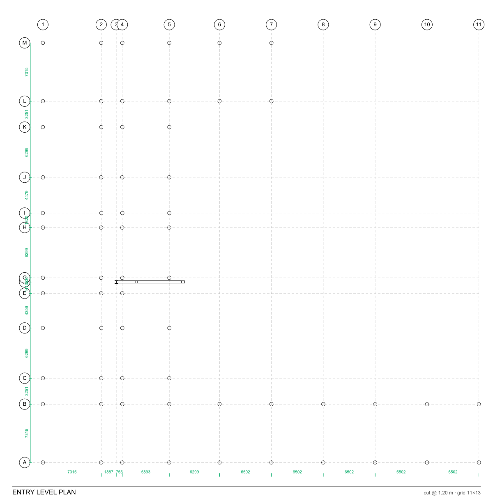
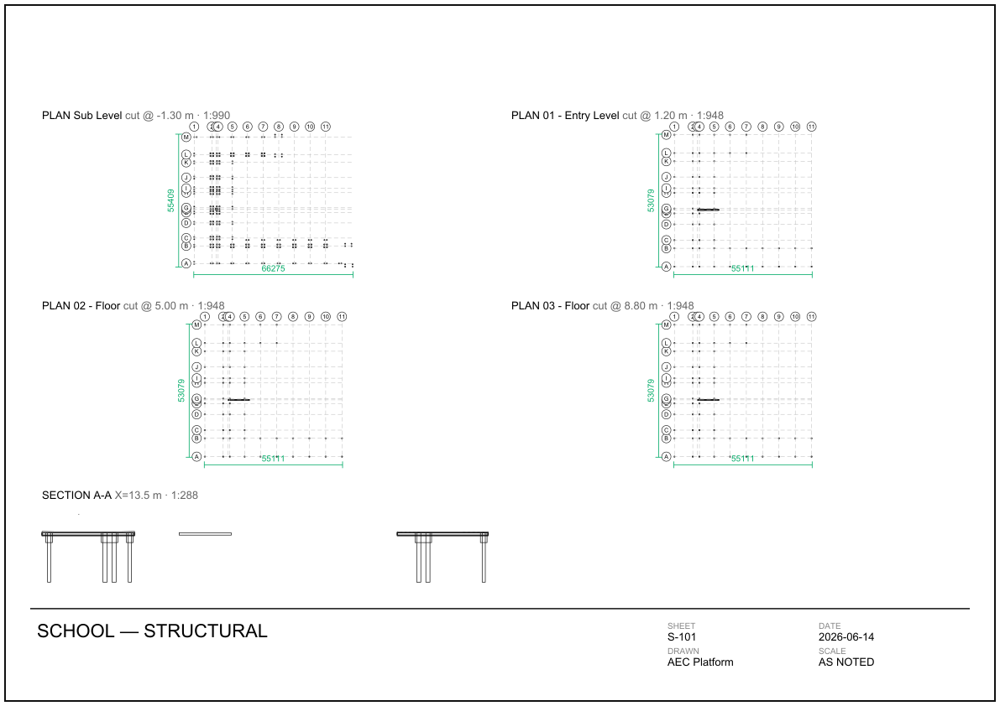
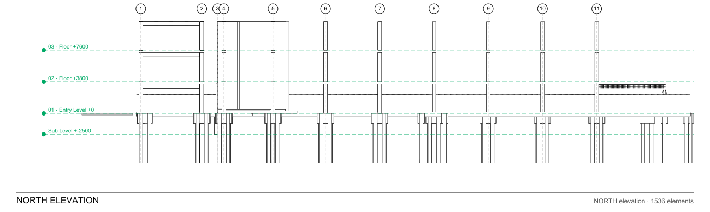

# Platform history

A narrative summary of how Massing filled out, by release band, plus the gallery of generated output.
Moved here from the README on 2026-07-29, where 245 lines of release narrative had accumulated ahead of
the sections a new reader actually needs.

> **This is a summary, not the record.** [../../CHANGELOG.md](../../CHANGELOG.md) is authoritative for
> every release; [../roadmap.md](../roadmap.md) is what is still open. Where this page and the changelog
> disagree, the changelog is right.
>
> Image paths below are relative to `docs/`, so they resolve when this file is read on GitHub.

## Recent platform work

> **The full log lives in [CHANGELOG.md](../../CHANGELOG.md)** (every release, newest first). The highlights below
> are a rolling snapshot; the [roadmap](../roadmap.md) tracks what's still open.

- **The drawing became data, and a firm got standards (v0.3.776–v0.3.786, current).**
  A **received sheet now has regions**: the rectangles a consultant's PDF was drawn with are read back
  out of its own content stream and classified — titleblock, revision table, legend, viewport — so a
  note or a takeoff attaches to *the view it governs* rather than to a page number. Deterministic
  vector geometry, not a document-AI dependency. Where the vectors are gone it returns a stated
  **`unknown`** rather than an empty list, and it never invents the page↔world scale: a scale printed
  on paper is a claim, offered for calibration to accept, never applied on its own.
  **Firm standards** now outlive a project — rule libraries live above the job and a project layers
  over them, with any override *visible as an override*, because the failure here is not a wrong answer
  but a firm discovering its standards had quietly become optional.
  The sample library gained a **real building**: a 1551-element school structure, packaged through the
  same publish path a user drives. It is structure-only, so Area and $/ft² read `—` with their reasons
  — the strip working, not a gap hidden.

- **The new shell is the app now — and it opens with something in it (v0.3.703–v0.3.775).**
  The six-room shell stopped being a preview and **became the default in v0.3.715**; the opt-out was
  **deleted in v0.3.779** — one front door, no second rail to keep in step. Since then it grew the
  parts that make a first run make sense:
  a **sample library** shipped as `.mass` project containers rather than loose IFC files, a **showcase
  house** authored by the same recipes a user drives, and a **first-run picker** so an empty install
  offers a way in instead of an empty screen. The rooms became the primary navigation —
  **Design · Planning · Cost · Schedule · Deal · Work**, with a live count on Work — beside a
  **NEXT BEST ACTION** button that names one thing to do and renders nothing when there is nothing, and a
  pinned rail that shows recents honestly labelled **RECENT** until you pin something.

  Underneath: **Node 24** and **Postgres 17**, a **mobile build gate** that actually compiles the Android
  app in CI, and a **version-consistency gate** after a drift that had run since v0.3.655.

- **The shell's first cut — and the 5D chain closed (v0.3.684–v0.3.702).**
  The app was restructured around **five rooms constant for every role**, so a module lives in one
  canonical place instead of a different one per persona. Alongside it: an **Inspector** that
  puts a six-state lifecycle strip over four tabs (Properties · Cost · Schedule · Field), 27 unlabeled
  toolbar glyphs replaced by labeled contextual verbs, a **ball-in-court work queue** you act on
  inline, and a **colour contract** — one meaning per colour, enforced by a test that reads the
  stylesheet in both directions.

  The 5D chain also closed end to end: quantities **measured from the model** rather than supplied by
  the caller, rates carrying their **source and vintage year**, the 4D and 5D bindings written
  **natively into IFC**, two estimates **diffable by GlobalId**, and — the link that never existed —
  a **schedule of values built from the estimate** instead of re-keyed from it, carrying each item's
  GlobalIds through to the pay application.

  A recurring rule shaped all of it: **a check that examined nothing must not report clean** — and its
  sharper sibling, *a self-consistency check is not a correctness check*.

- **Enterprise & finance-platform readiness + authoring-parity depth (v0.3.615–v0.3.651).**
  The enterprise program layer, grounded in shipped controls: a **STRIDE threat model** with a
  control→evidence verification matrix, a **SOC 2 readiness** control matrix, **incident runbooks +
  SLOs**, codified **engineering standards**, a per-release **SBOM artifact**, and a common-password
  **deny-list** on every password path. On the finance pillar: a **scenario review workflow**
  (draft → in-review → approved → published, immutable once approved, assumption changes audit-logged),
  **locked reporting periods** enforced in the engine so a closed month refuses postings everywhere
  (imports included), the **residual-land-value inverse solver**, **golden reference tests** for the
  return metrics, budget↔actuals **reconciliation** with import lineage, and an **investor pack**
  report preset + portfolio scenario compare. Authoring parity kept pace: **calculated schedule
  fields** (AST-whitelist formulas), **view templates** with deterministic resolution, **named type
  catalogs**, **instance parameter overrides** with reset-to-type, **level moves that carry their
  elements**, a broken-host/illegal-placement **constraints checker**, model-version **review
  states**, coordination depth (issue-board lifecycle + timelines, framed clash viewpoints, desktop
  walk mode), and the headless **`massing` CLI** with a CI model gate.
- **Provenance-first AI + the estimating/feasibility spine (v0.3.600–v0.3.614).** The R17 wave:
  **every AI answer now traces to its source** — a `CitedAnswer` contract where each claim cites the model
  element (GlobalId), record, rule, or document + revision it derives from, with a deterministic coverage %,
  an uncited-claim guard, source-conflict surfacing, and Exec/PM/Field persona lenses (no LLM in the loop for
  any of it). Around it, a run of deterministic engines: per-line **estimate confidence** + a
  **Basis-of-Estimate ledger** (exact qty/price variance decomposition), a **time-phased buyout schedule**
  (last-responsible-order dates from QTO × CPM), a **scope register** with gap analysis, **permit
  days-to-issue percentiles** and **absorption sell-out / lot-supply** underwriting levers, **% complete**
  from as-built presence, a property **fill-rate pivot** feeding bulk edits, **parcel geometry → FAR/coverage**
  compliance, **R/U-values computed from wall-assembly layers**, and a **transactional client portal**
  (tokenized approve/acknowledge with hard public-endpoint caps). CI now runs Node 22.
- **Design, MEP, field-productivity and buyout engines straight off the model (v0.3.591–v0.3.594).**
  Four deterministic engines, each computed from the model or the field data rather than reconstructed by AI:
  **design metrics** (floors · GFA · net-to-gross · unit count · area-by-type) plus a **daylight-factor
  estimate** from the model's own windows (CIBSE formula, clearly labelled an estimate); **MEP fittings**
  inferred over the port-connectivity graph (tee/cross at branches, reducer at a size step, elbow at a
  direction change) rolled straight into QTO; a **productivity actuals loop** (installed rate + crew
  utilization, actual vs planned takt); and **buyout packaging + quote scoring** (QTO → RFQ packages, quotes
  ranked on price + coverage completeness + lead time). All CI-green with CodeQL at 0.
- **Production observability + operational hardening (v0.3.586–v0.3.589).** The production-readiness
  stack landed, all **env-gated no-ops until configured**: **Alembic** DB migrations (a baseline schema
  revision + a CI drift-guard), **OpenTelemetry** distributed tracing (FastAPI + SQLAlchemy, sampling
  control), and **Sentry-compatible** error alerting (fail-open, with PII scrubbing). Alongside: opt-in
  `/metrics` auth + configurable compose limits, digest-pinned Docker base images, and a re-skin of the
  GitHub Pages onto one branded theme. Everything CI-green with CodeQL at 0.
- **Deriving the deal, the buyout and the FM register straight from the model (v0.3.573–v0.3.582).**
  A wave of deterministic, IFC-native engines — because the model *is* the source of truth, each is computed,
  not reconstructed by AI. A **massing optioneer** sweeps the zoning-envelope levers (floor-to-floor, core
  efficiency, coverage, unit mix) over the program engine and ranks the options by yield-on-cost with a
  cost-vs-profit Pareto frontier (🧮 panel). A **per-cost-code margin** view reconciles budget vs. committed
  vs. actual vs. billed into a projected buyout margin, flagging over-committed / over-budget codes worst-first
  (📒 money card), and every flagged code carries a **one-click Fix** action to the records behind it. The
  **maintainable-asset register** and the **procurement equipment schedule** both derive from the IFC by class
  — the FM handover register (🔧) one-per-GUID, the RFQ line-items (🔩) rolled up by type with representative
  spec — and a **spec-conflict** check cross-validates the modelled Pset values against the specified
  requirements. **Recipe-macros** capture a chained edit-recipe as a named, parameterized command that applies
  as one GUID-stable version.
- **Schedule optioneering, a whole-project "master builder" brief, and the owner client-portal (v0.3.543–v0.3.567).**
  A **schedule-optioneering** engine permutes crew loading, work-face zoning, fast-track overlap and trade
  sequence over the Takt line-of-balance model — scoring every scenario on makespan / cost / peak-crew
  congestion, ranking by a weighted time+cost score with a Pareto frontier, and recommending a plan against
  the project's own schedule (a 🧮 comparison panel drives it). A new **Master Builder brief** holds the
  entire project in one view — the 8-step protocol (place → program → feasibility → regulatory → design →
  delivery → risk → handover) run over the project's own data, grounded in its jurisdiction and the model's
  georeferenced coordinates, with a shareable Markdown one-pager. The **client-portal** gives an owner a
  tokenized read-only readiness link (a self-contained public page — no record data / GUIDs / financials /
  PII) and turns the selections log into money: **allowance-vs-actual** with over-allowance items pushed to
  **change events**. Plus a unified **model-warnings feed**, a **rebar bar-bending schedule** with per-bar
  legs/angles, and a second structural-solver exchange — **Code_Aster** `.mail` mesh beside the OpenSees
  `.tcl`. (The reasoning behind these ships as an in-repo **`master-builder` skill**.)
- **openBIM conformance, ISO 19650 automation & estimate depth (v0.3.413–v0.3.542).** The
  analytical chain got an **exit** — export the derived frame to **OpenSees (`.tcl`)** for third-party FE
  verification. openBIM QA gained a **normative conformance gauntlet** (header/schema/GlobalId/spatial-
  containment checks in the spirit of the buildingSMART validation service), a **standalone discipline-slice
  IFC export** (selector → a valid, GUID-stable IFC you hand a consultant), one-click **model-cleanup
  recipes**, and a live **BCF-API 2.1 (OpenCDE) server** so external managers sync issues without swapping
  `.bcfzip` files. ISO 19650 delivery became self-documenting: a **BIM Execution Plan generated from live
  project config**, a **BIM information-management responsibility template**, plus PMBOK **project-charter +
  lessons-learned** registers, an **Inspection & Test Plan**, and **commissioning as a first-class loop**
  (seed assets from the model → system×phase matrix). Estimating deepened — **three-point range estimates**
  (P10/P50/P90 bid range), **unit-rate cost assemblies**, and a **version→cost delta** (what a model revision
  costs). Plus **saved smart views**, stale-clash re-checks, a **rebar cage check + bar bending schedule**, a
  field **material-request + price-observation ledger**, and an optional **online licence bridge**.
- **Analysis depth, model QA and dev-velocity (v0.3.372–v0.3.412).** The **complete structural
  analytical chain** — gravity + lateral solve (ASCE 7 seismic ELF + wind MWFRS with a **§12.12 story-drift
  screen** and torsional-irregularity flag), member loads, shear-wall/slab surfaces, base supports → a
  solver-ready IFC. **MEP-SIZE** velocity checks, plan **VIEW-RANGE**, the rendered **COVER-SHEET** +
  drawing index, **EXPORT** (.glb + first-class IFC re-export), and 2D **TAKEOFF** from PDF/scan sheets.
  Model QA grew teeth: **element-level version diff** (what actually changed — renamed / re-typed /
  re-leveled / property & quantity deltas, click-to-select in 3D), an **export round-trip fidelity check**
  (proves the write path drops nothing — schema, units, GUIDs, storeys, property payload), and money-math
  regression tests across leases and change orders. Under the hood, a **dev-velocity program**: the test
  gate parallelized ~30 min → ~11 min, backend + web **import-cycle guards** in CI, and the worst files
  decomposed behind façades (the 2,127-line authoring engine → a foundation + five recipe leaves at 761
  lines, connectors and sheet renderers split the same way) — zero public-API change, all suites green.
- **Frontier tracks + designer-workspace UX + hardening (v0.3.341–v0.3.371).** Five large tracks
  landed end to end. A **structural analytical model** — `derive_analytical` idealises the physical frame into an
  `IfcStructuralAnalysisModel` (columns/beams → curve members, slabs → surface members, shared nodes, a
  self-weight load case). An **RFI-0 NL-QA** layer answers plain-language questions ("what governs this element?",
  "what's blocking approval?") with **cited sources** off a new **document/specification graph**. **Real-time
  co-editing** — a model-edit SSE stream + presence roster live-reloads a second viewer after a collaborator
  publishes, with an **optimistic edit-lock** (stale write → 409). A **visual node-authoring canvas** wires
  recipe nodes into a graph (output→input auto-injects the reference) and runs it as one GUID-stable pass. The
  **designer workspace** finished — a lifecycle **ribbon** over the tool rail, `type:`/`class:`/`discipline:`
  Library search + Recent, and a **Project-Browser spine** (views · sheets · schedules). Plus a **security
  hardening pass** — XXE-safe schedule-import parsing, dependency pins, and a clean audit (npm 0 vulns · bandit
  HIGH → 0 · secret-scan clean). See the changelog for each release.

- **Unified discipline tree · interactive annotation · 5D cost + vintages (v0.3.309–v0.3.340).** One
  canonical **CSI-MasterFormat / UniFormat / NCS discipline** vocabulary with a **colour palette** across the
  viewer, model browser, estimate, and both engines — **colour-by-discipline** in the 3D view (legend + paint
  model) and a MasterFormat-coded rollup. **Fire protection, fire alarm, and telecom** became first-class
  systems (`add_fire_equipment` / `add_fa_device` / `add_comms_device`), and the demo tower was rebuilt with a
  unitized **curtain-wall facade**, **fire-rated** construction, a **roof assembly**, and all eight disciplines.
  **Interactive annotation** — place `IfcAnnotation` notes, dimensions, element-aware **tags**, and **revision
  clouds** in the view, rendered onto the plans. **Cost + schedule depth** — a **vintage-versioned cost
  database** (COST-DB) so a project pins the exact cost vintage its estimate was built on (reproducible;
  offline public importer + a subscription-cloud path), the estimate prices **through** the pinned vintage, and
  the labour estimate rolls crew-days into a **schedule duration**. **Code depth** — an **existing-building**
  (IEBC) work-area classifier, **missing-dimension** detection in the RFI-prevention audit, and the applicable
  code requirements emitted as a validatable **buildingSMART IDS**. See the changelog for each release.

- **Wave 11 — LOD-400/500 authoring + the construction-document set (v0.3.255–v0.3.308).** The
  Model workspace became a genuine authoring-to-issue tool. A **view-keyed representation + LOD spine**
  (tag elements 100→500); a **power-selection** query over the IfcOpenShell selector DSL; **parametric
  door/window** generators (real lining/frame/panel); a **domain-geometry catalog** behind an "Advanced
  fabrication" toggle — **steel connections** (base plates, shear tabs), **rebar cages**, **MEP fittings**,
  and **curtain-wall systems**; **classification + detail-document carriers** and an **IDS-shaped
  detail-rule engine** (exterior-window → IBC/ASTM flashing detail + spec/keynote codes). On top: the whole
  **construction-document set** — plan/section/elevation SVG → **PDF + DXF**, **issuable ARCH-D sheets**
  with titleblocks, computed **door/window/room schedules**, and a **3-part MasterFormat project manual**.
  **Code intelligence** — a **G-series IBC code-analysis** summary, a **jurisdiction-adopted-edition**
  catalog, and an **approvability pre-flight** (permit-readiness). **LOD-500 turnover** — field-verified
  **as-built** stamping + **manufacturer/serial** (COBie-ready), rolled into a five-lens **Model Health
  scorecard**. And the **AI authoring command bar** — natural language → a validated recipe plan
  (deterministic baseline + optional Claude multi-step planning), guarded by an **authoring guardrail**
  that rejects broken IFC before it writes. The **Master-Builder** close-out (v0.3.294–v0.3.308) then made
  the tool complete: **model undo/redo** (versioned, GUID-stable), automatic **drawing inference**,
  **sloped-top walls** (parapet/shed/gable), a **procedural-mesh** and an AST-**sandboxed `ifcopenshell`**
  escape hatch (feature-flagged; a proven RCE escape closed on review), a **site content library**
  (logistics / furniture / landscaping, auto-classified + logistics time-phased on the 4D slider), **MEP
  port-to-port connectivity** + a dangling-element report, **NCS detail callouts** on the plan,
  **edition-aware** occupant-load factors, a **decision-readiness (RFI-prevention) audit**, a
  **productivity-rate labour estimate** (man-hours/unit → cost + crew-days + duration), and **field-verified
  as-built dimensions + variance** for the LOD-500 turnover layer. See the changelog for each release.

- **Since v0.3.113 — the platform filled out end to end (→ v0.3.228).** The complete
  **acquisition → design → build → turnover → operate** lifecycle (RIBA/AIA phase gates, soft-cost
  itemization, ASI/bulletins/SK, G704 turnover, FCA/FCI + reserves operations); **openBIM standards depth**
  (IDS→BCF, bSDD, COBie Contact/Zone/System, IFC4.3 infra, ISO 19650 CDE); **AI over the model**, the
  per-discipline **drawing-set spine**, **climate/water resilience**, **scan-to-BIM + 2D→BIM + Gaussian
  splats**; enterprise **auth** (TOTP MFA, SAML/SCIM, session revocation); and a four-domain
  **code-quality/hardening** initiative. Most recently, **generative-design & analysis depth**: per-floor
  **column taper + lateral core**, **parcel-aware surface parking**, a specialty **multi-year P&L + ramp +
  blended IRR** with **Monte-Carlo** risk, **actual-vs-takt** production tracking, a per-project **material
  editor**, a **module-relations graph**, a 9-slide **investor pitch deck**, and a **Finance command-center
  home**. See the changelog for each release.

- **The earlier record (v0.1 → v0.3.113)** — module engine + workflow gating, proforma/waterfall,
  EVM, authoring from the first Draft panel through steel/rebar/MEP families, document control,
  market intelligence, openBIM CDE/KPI depth, lean pull-planning, operations/resilience, and the
  design-to-turnover lifecycle — lives release-by-release in [CHANGELOG.md](../../CHANGELOG.md) and
  thematically in [docs/roadmap-completed.md](../roadmap-completed.md).

## Gallery

**Generative design — lot → IFC model → acquisition proforma** (openBIM end to end): a zoning
envelope generates a real IFC massing you can then furnish from a starter
family library. (Vector renders of the redesigned UI; numbers are an actual solve.)

| Generate from zoning → IFC + proforma | Furnish & equip (starter IFC family library) |
|---|---|
|  |  |

Generated directly from the IFC by the data service (BIM), plus GC schedule charts:

| Dimensioned grid plan | Composed sheet (A3) | North elevation (HLR) | Room tags |
|---|---|---|---|
|  |  |  |  |

The dimensioned plan derives the structural grid from column positions (no `IfcGrid` needed),
adds numbered/lettered bubbles and grid-spacing dimensions; the sheet composes per-storey
plans + a section under a title block (also exported as PDF).

GC portal schedule visuals (from the `schedule_activity` module):

| Gantt | Line of Balance |
|---|---|
|  |  |

Platform interface (vector renders of the redesigned UI — see the [live demo](https://massing.build/app/) for the running app):

| Tools panel + readable results | 80-module portal catalog |
|---|---|
|  |  |

The ⚙ Tools panel is a persona-ordered, collapsible, state-aware accordion (secondary tools fold
under "More tools"; analysis opens in a readable modal); the GC-portal catalog tames the full module
set with ★ favorites, collapsible persona-aware sections, and a filter.

*(The module count that stood here has been removed rather than updated. This is a history file — it
should not be where anyone reads a current figure, and a number in a record of past states is
guaranteed to drift. `GET /modules` is authoritative; [../user-guide/modules.md](../user-guide/modules.md)
carries the current count, gated against the files on disk.)*

